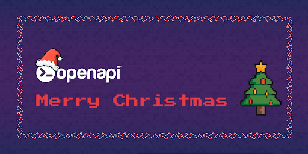

<div align="center">
  <a href="https://openapi.com/">
    
  </a>

  <h1>🎄✨ GitHub Christmas Party ✨🎅 </h1>
  <h4>The Most Festive Repo on Earth</h4>

  
  
  
  
  
  
  
    
</div>

# Welcome

Welcome, traveler of the Internet! ❄️ You’ve just entered the **official GitHub Christmas Party Repository** — a magical place where code meets Christmas, pull requests meet panettone, and issues turn into digital fireplaces. 🔥💻

This repo is **a party**, not a project. A celebration of community, creativity, and glorious nerdiness. And the *main dance floor* is right here on GitHub.

## 🎁 **How to Join the Party (SUPER EASY!)**
### 👉 [**Go to Issue #1 and leave a comment!**](https://github.com/openapi/xmas-party/issues/1)

That’s it. That’s the whole party.  
No configuration.  
No setup.  
No virtualenv, no npm install, no docker-compose.  
Just pure, unfiltered holiday joy. 🎅✨

[**➜ Sign the Guestbook by commenting on Issue #1**](https://github.com/openapi/xmas-party/issues/1) 🎄  

You can drop:
- 🎨 ASCII art
- 🐇 the legendary ASCII bunny
- 🎄 Christmas trees
- 📦 code snippets
- 🌐 nerdy jokes
- 🎞️ GIF animate
- 🤖 AI-generated Santa debugging Python
- 💣 the Grinch sabotaging your CI/CD

Make it festive. Make it weird. Make it yours.  
This issue is our **Wall of Holiday Fame**. 🌟


## 🎄 **A Christmas Tree for Courage**

```
                 *
                /_\
               /___\
              /_____\ 
             /_______\
            /_________\
           /___________\
          /_____________\
         /_______________\
                | |
                | |
  🎅 Leave your mark in Issue #1 🎅
```


## ⭐ **What You Can Do Here**
This repo is a playground of festive nonsense:

### 🎅 1. **Sign the Guestbook ([Issue #1](https://github.com/openapi/xmas-party/issues/1))**
The heart of the celebration — write anything you want.

### ❄️ 2. **Create Emoji Banners**
Fill the comments with the most insane emoji Christmas banners ever created.

### 🧝 3. **Drop AI-Generated Chaos**
Santa doing bug hunting on a Python repo?  
The Grinch breaking CI pipelines?  
Elf DevOps resolving merge conflicts?  
We want ALL OF IT.

### 🎧 4. **Join the Virtual DJ-Set**

No Christmas party is complete without music — especially a **geek one**.

This repository hosts a **virtual DJ-set**, curated by developers, hackers, and elves from all over the world.  
Think of it as a shared playlist where **code meets rhythm** and the sleigh runs on beats instead of fuel.

📁 **DJ-Set Folder**  
All tracks, playlists, and references live here:

👉 [**`/dj-set/`**](https://github.com/openapi/xmas-party/tree/main/dj-set)  
(Feel free to browse, listen, and contribute!)

🎅 Santa’s rule:
> If it makes you want to code at 3 AM with hot cocoa and blinking LEDs, it belongs here.

Turn up the volume, fork the repo, and let the Christmas beats flow. 🔊✨

### 🎁 5. **Explore the Magical File: `SANTA.md`**
A lore-filled holiday letter explaining the philosophy of this party.

## 🎅 **Contest Alert!**
The **3 most legendary comments** left in Issue #1 will be featured:
- ⭐ On social media
- ⭐ In the repo's Hall of Fame
- ⭐ In Santa’s good list for 2025

Be creative. Be chaotic. Be festive. 🌟

## ❄️ **Why This Repo Exists**

Because the world needs more joy.  
Because developers also deserve a holiday party.  
Because creativity should be celebrated.  
And because GitHub Issues make a surprisingly good Christmas guestbook. 😂

## 🎄 **Join the Celebration Now**

👉 Go to [**Issue #1**](https://github.com/openapi/xmas-party/issues/1)  
👉 Write ANYTHING festive  
👉 Become part of the GitHub Christmas Party lore

**Ho-Ho-Hack the Planet!** 🎅💥🌐
